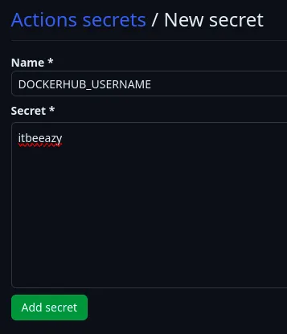
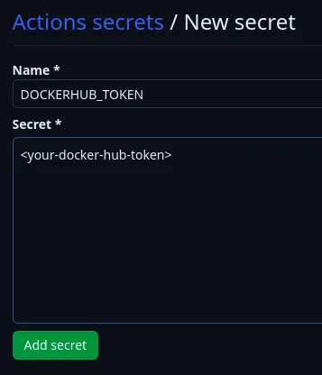

# CI/CD Made Easy: GitHub Actions, Docker Compose, and Watchtower

Continuous Integration and Continuous Deployment (`CI/CD`) pipelines are an essential part of streamlining software development workflows, ensuring top-notch code quality, and delivering updates with speed and accuracy.

`Docker` has become a go-to tool for packaging software into containers that can be easily deployed across different environments, making it a ubiquitous aspect of CI/CD pipelines. 

Furthermore, there are various orchestration tools available, including `Kubernetes`, `Docker Swarm`, and `Docker Compose`. Among these, Docker Compose stands out as a more simpler and straightforward orchestration tool that enables users to manage Docker containers seamlessly.


Let’s add a Github `Actions` workflow in our project directory. Create a directory named `.github` and inside that directory create another directory named workflows. 

All our workflow files will be stored inside this directory. Create a file named `publish.yml` which will make the complete path as `.github/workflows/publish.yml`.

Inside publish.yml, paste the code below:

```yaml

name: pipeline
on:
  push:
    branches:
      - 'your-branch-to-build-from'
jobs:
  deploy:
    name: build && push image to docker hub
    runs-on: ubuntu-latest
    steps:
      - uses: actions/checkout@v3
        with:
          ref: 'same-as-branch-mentioned-above'
    
      - name: setup docker buildx
        uses: docker/setup-buildx-action@v2
    
      - name: docker login
        uses: docker/login-action@v2
        with:
          username: ${{ secrets.DOCKERHUB_USERNAME }}
          password: ${{ secrets.DOCKERHUB_TOKEN }}
      
      - name: build and push api
        id: build-push-api
        uses: docker/build-push-action@v3
        with:
          context: .
          file: Dockerfile
          push: true
          tags: <your-dockerhub-username>/<your-dockerhub-repo>:<image-tag>

```

Head over to Github Secrets page from Settings > Secrets and variables > Actions and click on New repository secret. Enter your docker hub username as shown below:



Similarly, create another secret to store docker hub access token that we created in the earlier step.




In some cases, GitHub Actions maybe disabled by default. Go to `Settings > Actions > General` and make sure `Allow all actions and reusable workflows` is chosen.