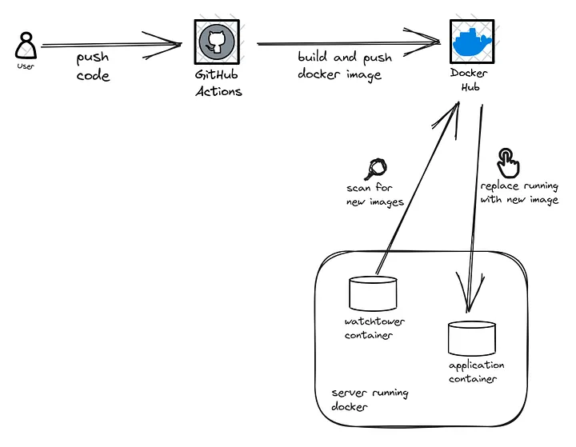

# CI/CD Made Easy: GitHub Actions, Docker Compose, and Watchtower

Continuous Integration and Continuous Deployment (`CI/CD`) pipelines are an essential part of streamlining software development workflows, ensuring top-notch code quality, and delivering updates with speed and accuracy.

`Docker` has become a go-to tool for packaging software into containers that can be easily deployed across different environments, making it a ubiquitous aspect of CI/CD pipelines. 

Furthermore, there are various orchestration tools available, including `Kubernetes`, `Docker Swarm`, and `Docker Compose`. Among these, Docker Compose stands out as a more simpler and straightforward orchestration tool that enables users to manage Docker containers seamlessly.

